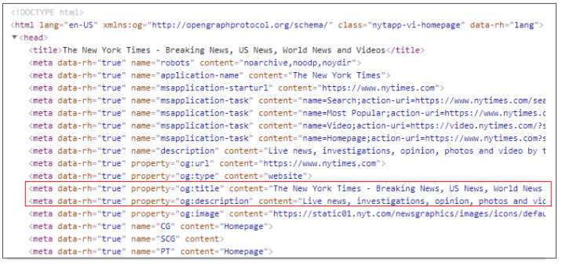

# HTML Document Structure

Every HTML document must contain the following structure. 

```markup
<!DOCTYPE html>
<html>

  <head>
    <title></title>
  </head>

  <body>
  </body>
  
</html>
```

### \<!DOCTYPE html>

The \<!DOCTYPE> declaration lets the browser know which version of HTML your file is written in. For the current version, HTML5, it has been simplified to just require what's above.

### \<html>

The top-level HTML element that will contain all of your other HTML tags. It defines the beginning and end of your HTML document.

### \<head>

The elements in this section provide general information about your web page and will not be displayed as part of the page content. The information is used by the web browser and search engines.

There are a few child elements in this section that you need to know about early on.

* **`<title>`**: used to set what is displayed on the browser's title bar.
* **`<link>`**: use to include external stylesheets or custom fonts.

## \<body>

The body element contains all of the content of a HTML document. It is the visible portion of the web page. **This is where your content will go.**

## \<meta>


This is not an area where you will need to make modifications, unless you are doing more advanced settings.

The one exception is the title element, which is what is displayed in the browser tab.


```markup
<head>
    <meta charset="UTF-8">
    <meta http-equiv="X-UA-Compatible" content="IE=edge">
    <meta name="viewport" content="width=device-width, initial-scale=1.0">
    <title>Document</title>
</head>
```

Metadata is data about data. It is always contained within the `<head>` element. Data from this section will not be displayed on the page.

A lot of the meta elements are used to assist search engines to find the page and provide information for the search result.

If you search for NY Times on Google, you will see the following result. The text in red is taken from the meta attributes title and description.

.png>)



###

### Creating HTML Documents in VS Code

Visual Studio Code has a convenient short-cut to generate this boilerplate code. If you just type the "!" character, followed by the "Tab" key, the following HTML will be automatically added to your file. The boiler-plate HTML generated by VS Code puts in a default value of "Document" for the page title. Remember to change this to something appropriate for your web page.

```markup
<!DOCTYPE html>
<html lang="en">
<head>
  <meta charset="UTF-8">
  <meta http-equiv="X-UA-Compatible" content="IE=edge">
  <meta name="viewport" content="width=device-width, initial-scale=1.0">
  <title>Document</title>
</head>
<body>
  
</body>
</html>
```
